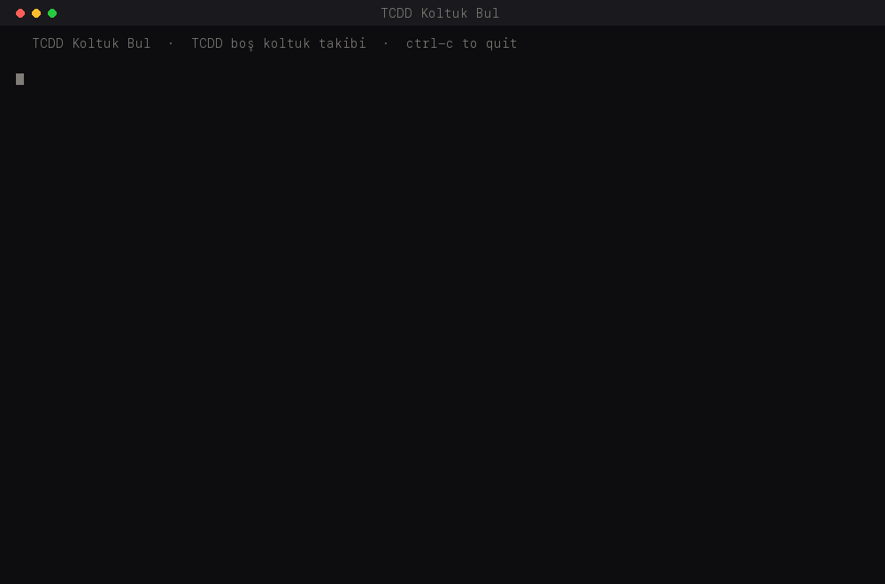

<div align="center">

# TCDD Koltuk Bul

### Catches a seat the moment someone cancels, and holds it for you


**460 stations · YHT, Anahat, Bölgesel · checks every minute · free · runs on your own computer**

for `ebilet.tcddtasimacilik.gov.tr`

[Türkçe](docs/i18n/README.tr.md) ·
[Deutsch](docs/i18n/README.de.md) ·
[Русский](docs/i18n/README.ru.md) ·
[العربية](docs/i18n/README.ar.md) ·
[فارسی](docs/i18n/README.fa.md) ·
[Français](docs/i18n/README.fr.md) ·
[Español](docs/i18n/README.es.md) ·
[Nederlands](docs/i18n/README.nl.md) ·
[Български](docs/i18n/README.bg.md) ·
[Українська](docs/i18n/README.uk.md)

[Polski](docs/i18n/README.pl.md) ·
[Română](docs/i18n/README.ro.md) ·
[Ελληνικά](docs/i18n/README.el.md) ·
[Italiano](docs/i18n/README.it.md) ·
[Azərbaycanca](docs/i18n/README.az.md) ·
[ქართული](docs/i18n/README.ka.md) ·
[中文](docs/i18n/README.zh.md) ·
[日本語](docs/i18n/README.ja.md) ·
[한국어](docs/i18n/README.ko.md)



</div>

---

Busy TCDD trains sell out weeks ahead, but people cancel constantly. The seat is there for
a minute and then it is gone. I got tired of refreshing the page hoping to be the one
looking at it when that happened, so I wrote this.

Works across the whole network: all 460 stations, both directions, YHT, Anahat and
Bölgesel. No route, train or class is written into the code. It reads all of that off the
site every time.

## How it works

1. You type where you are going. Typos are fine.
2. You type which day, or several days if you are flexible.
3. It opens Chrome and lists every train, with the price and free seats of each class.
4. You pick the trains and the classes you would actually take, and what the alarm
   should be.
5. It checks again every minute or so, quietly, in the background.
6. When a seat appears it selects it, picks the seat on the map, and holds it.
7. It beeps until you come and pay.

That is it. You leave it running and go do something else.

## Example run

```
  TCDD Koltuk Bul  ·  TCDD boş koltuk takibi  ·  ctrl-c to quit

  from: ista
     1) İSTANBUL(PENDİK) , İSTANBUL
     2) İSTANBUL(HALKALI) , İSTANBUL
     3) İSTANBUL(BAKIRKÖY) , İSTANBUL
     4) İSTANBUL(BOSTANCI) , İSTANBUL
     5) İSTANBUL(SÖĞÜTLÜÇEŞME) , İSTANBUL
    which one? (number, or keep typing) 5
  to: ankra
    did you mean ankara?
     1) ANKARA GAR , ANKARA
     2) SİNCAN , ANKARA
    which one? (number, or keep typing) 1

  which day? one, or a few if you are flexible
    17         only the 17th
    17 18 21   any of those three, commas fine too
  days: 25 26

  25.08.2026 Salı
   1  05:30 → 09:59  4sa 29dk   YHT: 81002 İSTANBUL-ANKARA
      BUSİNESS ₺1.395,00 (38) · EKONOMİ ₺930,00 (233) · TEKERLEKLİ SANDALYE ₺930,00 (2)
   3  08:23 → 12:58  4sa 35dk   YHT: 81030 İSTANBUL - ANKARA
      BUSİNESS ₺1.395,00 (1) · EKONOMİ ₺930,00 (40) · LOCA DOLU · TEKERLEKLİ SANDALYE ₺930,00 (2)
   4  09:00 → 13:15  4sa 15dk   YHT: 81458 İSTANBUL-SİVAS   dolu

  watch which? [1 3 5 · 08:23 · all] 3 4

    1) BUSİNESS
    2) EKONOMİ
    3) LOCA
    4) TEKERLEKLİ SANDALYE   only for wheelchair users
  which classes would you take? [1 2 4 · enter = all but wheelchair · all = everything] 2

  travelling as bay or bayan? b

  watching 2 train(s)
  sweep 6 found nothing · looking again in  62s
```

An hour later somebody cancels:

```
  08:23 YHT: 81030 İSTANBUL - ANKARA -> 12:58  EKONOMİ ₺930,00 (1)
  held -> wagon 5, seat 21c

  press ENTER to stop the alarm...
  browser is left open on the seat. go and pay.  ctrl-c here when you are done.
```

## Setup

You do not need to know anything about programming. Follow these in order.

### Step 1. Open the terminal

This is the black window where you type commands. It is already on your computer.

- **macOS**: press `Cmd` and `Space` together, type `Terminal`, press Enter.
- **Windows**: click Start, type `PowerShell`, press Enter.
- **Linux**: press `Ctrl` `Alt` `T`.

### Step 2. Go to your Desktop

Type this and press Enter. It moves you to your Desktop folder, which is where the program
will be installed so you can find it easily afterwards.

```bash
cd ~/Desktop
```

On Windows, type this instead:

```powershell
cd $HOME\Desktop
```

Nothing visible happens. That is correct. The text at the left of your cursor should now
end in `Desktop`.

### Step 3. Install it

Copy the line below, paste it into the terminal, press Enter.

**macOS and Linux:**

```bash
curl -fsSL https://raw.githubusercontent.com/Coflazo/TCDD-Koltuk-Bul/main/install.sh | bash
```

**Windows:**

```powershell
irm https://raw.githubusercontent.com/Coflazo/TCDD-Koltuk-Bul/main/install.ps1 | iex
```

Now wait. It will print what it is doing, step by step. It downloads a browser, so it
takes about a minute. Do not close the window while it works. When it is finished it says
`Done.` and tells you where it put everything.

A folder called `TCDD-Koltuk-Bul` is now on your Desktop.

### Step 4. Run it

Open that folder and double-click:

- **macOS and Linux**: `Başlat.command`
- **Windows**: `Baslat.bat`

The first time on macOS you may get a warning about an unidentified developer. Right-click
the file instead, choose Open, then Open again.

### Step 5. Answer its questions

It asks where you are going, which days, which trains, which classes, and what should
wake you up when it finds something. Type the answers, press Enter after each. For the
alarm you can press Enter for the default video, paste a YouTube link of your own, point
it at a sound file on your computer, or type `beep` for sound only. All of this is explained in [How it works](#how-it-works) above.

### Step 6. Leave it alone

Once it starts checking, a Chrome window opens by itself. **Do not close it and do not
click inside it.** That window is the program working. You can leave both windows behind
other windows and carry on using your computer normally.

At the bottom of the terminal you will see a line counting down and changing:

```
  sweep 6 found nothing · looking again in  62s
```

That means it is working. It repeats roughly every minute, for as long as it takes.

A few things to keep in mind while it runs:

- **Do not shut your computer down**, and stop it going to sleep. On macOS this is System
  Settings, Lock Screen. On Windows it is Settings, System, Power. If the computer sleeps,
  it stops checking.
- **Keep the internet connected.**
- **Do not close the terminal window.** Closing it stops the program.

### Step 7. When it finds a seat

It beeps repeatedly, opens a video, and stops checking. The Chrome window is now sitting
on your seat, already held. Go to that window, fill in your details and pay, the same as
you would normally.

Press Enter in the terminal to stop the beeping.

To stop the program at any time, click the terminal and press `Ctrl` and `C` together.

<details>
<summary>Manual install</summary>

```bash
git clone https://github.com/Coflazo/TCDD-Koltuk-Bul.git
cd TCDD-Koltuk-Bul
python3 -m venv .venv && source .venv/bin/activate
pip install -r requirements.txt
patchright install chromium
python3 koltukbul.py
```

On Windows use `py` instead of `python3`, and `.\.venv\Scripts\Activate.ps1` to activate.
If PowerShell blocks that script, run
`Set-ExecutionPolicy -Scope Process -ExecutionPolicy Bypass` first.

</details>

## For developers

Real result pages from the live site are saved in `tests/fixtures/`. Replay mode runs the
scraper over them, with no browser, no network and no TCDD account:

```bash
pip install beautifulsoup4 lxml
python3 koltukbul.py --replay
```

`scan()` and `read_classes()` are not reimplemented for replay. They are the same
functions that read the live site, pointed at a saved page through a small shim, so a
broken selector breaks the offline run too.

```bash
python3 koltukbul.py --test
```

Checks the date formats, the pick syntax, Turkish folding, the did-you-mean ranking, the
saved-page scrape, and the rule that a wheelchair place is only watched when it was asked
for. Prints `ok` and nothing else.

## Settings

Nothing is hardcoded:

| Variable | Default | What it does |
|---|---|---|
| `TCDD_POLL` | `45,90` | seconds between checks, randomised in this range |
| `TCDD_VIDEO` | a YouTube link | opened when a seat is found |
| `TCDD_PROFILE` | `~/.koltukbul_profile` | Chrome profile folder |
| `TCDD_STATE` | `~/.koltukbul.json` | remembered stations and gender |
| `TCDD_DEBUG` | `debug` | where failure screenshots go |
| `TCDD_HOME` | TCDD e-bilet URL | site root |

Stations and gender are remembered, so the second run is mostly pressing enter.

## Requirements

| | |
|---|---|
| Python | 3.8 or newer |
| Runtime dependency | [`patchright`](https://github.com/Kaliiiiiiiiii-Vinyzu/patchright), or plain `playwright` |
| Browser | Chromium via `patchright install chromium`, or installed Google Chrome |
| OS | macOS, Windows, Linux |
| Replay mode only | `beautifulsoup4` and `lxml` |
| Everything else | standard library |

It needs a desktop session, because the browser runs headful on purpose. Headless is easy
for a site to spot, and there is nothing to hide: this is one person's browser doing one
person's booking.

## Use, limits and legal

Read [DISCLAIMER.md](DISCLAIMER.md) before using this. [Türkçe](docs/i18n/DISCLAIMER.tr.md)

- Personal use. One traveller, one seat. There is no multi-passenger mode, on purpose.
- Not for resale or scalping. Reselling tickets can be an offence in Turkey.
- Payment is never automated. It never sees, stores or types card details.
- Nothing is bypassed. No captcha solving, no login bypass, no payment bypass.
- One browser, one check every 45 to 90 seconds. Do not turn it into a load test.
- Your data stays on your machine. Only your stations and bay/bayan are saved, locally.
- Wheelchair places are excluded unless you explicitly select them. They exist for people
  who cannot use any other seat.
- Complying with TCDD's terms of use is your responsibility. Read them.

No warranty. See [LICENSE](LICENSE).

Not affiliated with, endorsed by or connected to TCDD Taşımacılık A.Ş. The name identifies
which website this reads, nothing more.
